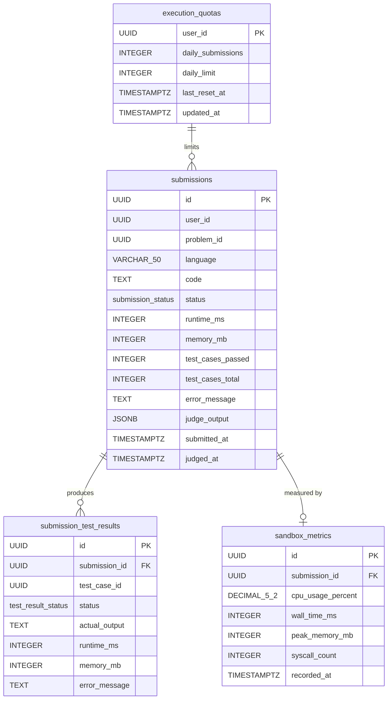
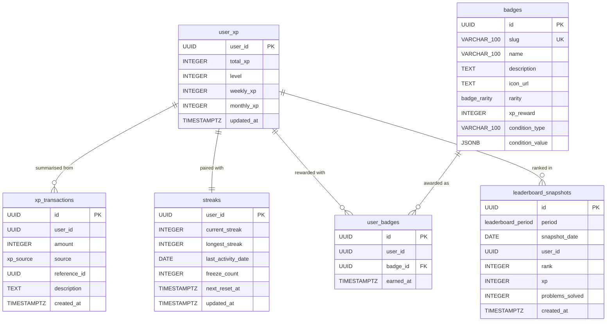
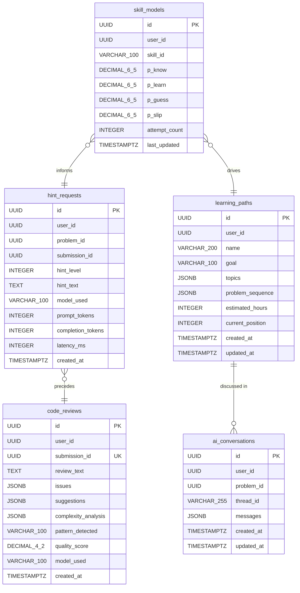
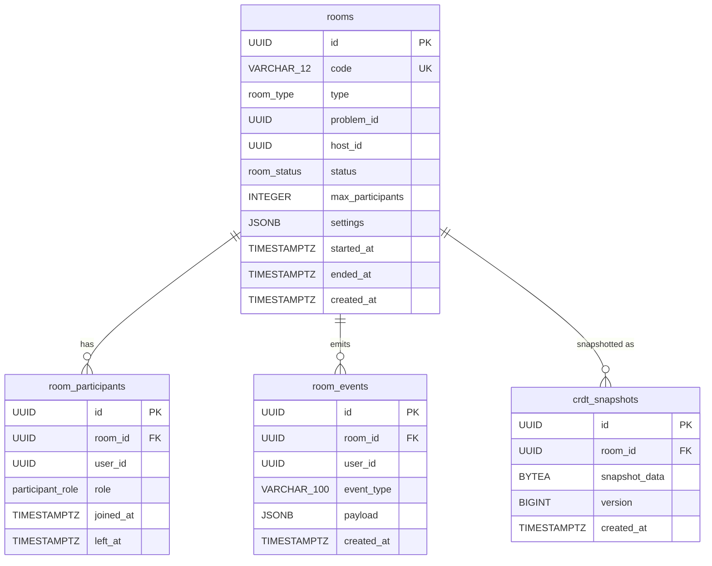
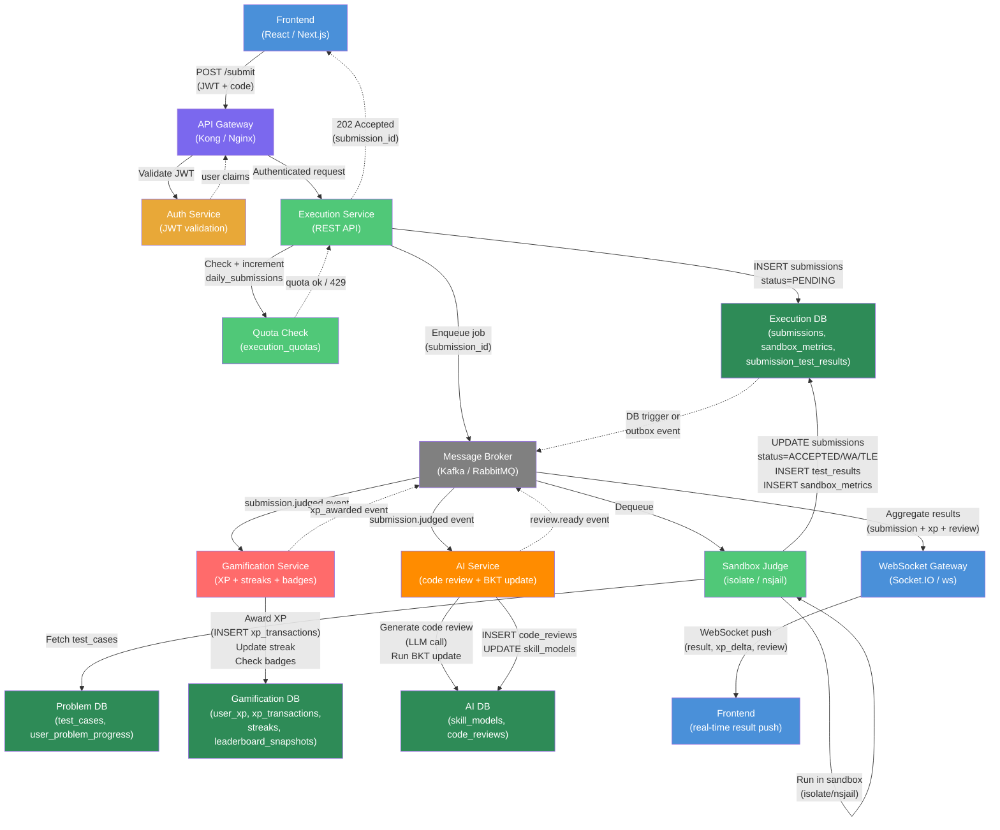

# AlgoVerse — Entity Relationship Diagrams

All diagrams use [Mermaid](https://mermaid.js.org/) `erDiagram` syntax.
Relationship notation:

| Symbol | Meaning |
|--------|---------|
| `||` | Exactly one |
| `o|` | Zero or one |
| `}|` | One or many |
| `}o` | Zero or many |

---

## 1. Auth Service ERD

> Tables: `users`, `oauth_providers`, `sessions`, `mfa_configs`, `audit_log`

```mermaid
erDiagram
    users {
        UUID id PK
        VARCHAR_255 email UK
        VARCHAR_255 password_hash
        VARCHAR_100 display_name
        TEXT avatar_url
        user_role role
        BOOLEAN email_verified
        TIMESTAMPTZ created_at
        TIMESTAMPTZ updated_at
        TIMESTAMPTZ deleted_at
    }

    oauth_providers {
        UUID id PK
        UUID user_id FK
        VARCHAR_50 provider
        VARCHAR_255 provider_user_id
        TEXT access_token_encrypted
        TEXT refresh_token_encrypted
        TIMESTAMPTZ expires_at
        TIMESTAMPTZ created_at
    }

    sessions {
        UUID id PK
        UUID user_id FK
        VARCHAR_255 refresh_token_hash UK
        VARCHAR_255 device_fingerprint
        INET ip_address
        TEXT user_agent
        TIMESTAMPTZ expires_at
        TIMESTAMPTZ revoked_at
        TIMESTAMPTZ created_at
    }

    mfa_configs {
        UUID id PK
        UUID user_id FK_UK
        VARCHAR_255 totp_secret_encrypted
        TEXT_ARRAY backup_codes_encrypted
        BOOLEAN enabled
        TIMESTAMPTZ created_at
    }

    audit_log {
        UUID id PK
        UUID user_id
        VARCHAR_100 action
        VARCHAR_100 resource_type
        UUID resource_id
        JSONB metadata
        INET ip_address
        TIMESTAMPTZ created_at
    }

    users ||--o{ oauth_providers : "has"
    users ||--o{ sessions : "owns"
    users ||--o| mfa_configs : "configures"
    users ||--o{ audit_log : "generates"
```

**Key design decisions:**
- `password_hash` is `NULL` for OAuth-only accounts.
- `deleted_at` enables soft-delete; partial indexes exclude soft-deleted rows.
- `sessions.revoked_at` is set on logout or token rotation. A partial unique index on `refresh_token_hash WHERE revoked_at IS NULL` prevents replay attacks.
- `mfa_configs` is a 1:1 relation (enforced by `UNIQUE(user_id)`).
- `audit_log` is append-only; no `UPDATE`/`DELETE` should ever touch it.
- Row Level Security on `users` ensures each application session can only `SELECT` its own row.

---

## 2. Problem Service ERD

> Tables: `problems`, `test_cases`, `problem_templates`, `topics`, `problem_topics`, `editorials`, `solutions`, `user_problem_progress`

```mermaid
erDiagram
    problems {
        UUID id PK
        VARCHAR_200 slug UK
        VARCHAR_500 title
        TEXT description
        problem_difficulty difficulty
        problem_status status
        DECIMAL_5_2 acceptance_rate
        INTEGER submission_count
        TEXT_ARRAY tags
        TEXT_ARRAY companies
        TEXT constraints
        TEXT_ARRAY hints
        UUID editorial_id FK
        UUID created_by
        TIMESTAMPTZ created_at
        TIMESTAMPTZ updated_at
        TSVECTOR search_vector
    }

    test_cases {
        UUID id PK
        UUID problem_id FK
        TEXT input
        TEXT expected_output
        BOOLEAN is_sample
        BOOLEAN is_hidden
        DECIMAL_4_2 weight
        INTEGER time_limit_ms
        INTEGER memory_limit_mb
        TEXT explanation
        TIMESTAMPTZ created_at
    }

    problem_templates {
        UUID id PK
        UUID problem_id FK
        VARCHAR_50 language
        TEXT starter_code
        TEXT solution_code
    }

    topics {
        UUID id PK
        VARCHAR_100 name UK
        VARCHAR_100 slug UK
        UUID parent_id FK
        TEXT description
        VARCHAR_50 icon
    }

    problem_topics {
        UUID problem_id FK
        UUID topic_id FK
    }

    editorials {
        UUID id PK
        UUID problem_id FK_UK
        TEXT content
        VARCHAR_50 time_complexity
        VARCHAR_50 space_complexity
        JSONB approaches
        UUID author_id
        BOOLEAN published
        TIMESTAMPTZ created_at
        TIMESTAMPTZ updated_at
    }

    solutions {
        UUID id PK
        UUID problem_id FK
        UUID user_id
        VARCHAR_50 language
        TEXT code
        BOOLEAN is_official
        INTEGER upvotes
        TIMESTAMPTZ created_at
    }

    user_problem_progress {
        UUID user_id PK
        UUID problem_id PK_FK
        user_problem_status status
        INTEGER attempts
        TIMESTAMPTZ first_solved_at
        TIMESTAMPTZ last_attempted_at
        INTEGER best_runtime_ms
        INTEGER best_memory_mb
    }

    problems ||--o{ test_cases : "has"
    problems ||--o{ problem_templates : "has"
    problems ||--o| editorials : "explained by"
    problems ||--o{ solutions : "answered by"
    problems ||--o{ user_problem_progress : "tracked in"
    problems }o--o{ topics : "tagged with"
    problem_topics }|--|| problems : "maps"
    problem_topics }|--|| topics : "maps"
    topics ||--o{ topics : "parent of"
```

**Key design decisions:**
- `search_vector` is a `GENERATED ALWAYS AS ... STORED` `TSVECTOR` column; GIN-indexed for sub-millisecond FTS.
- `problems.editorial_id` is a forward-reference FK added via `ALTER TABLE` after `editorials` is created.
- `problem_templates` has a `UNIQUE(problem_id, language)` constraint — one starter per language.
- `topics` is a self-referential tree; `parent_id = NULL` denotes root topics.
- `user_problem_progress` PK is `(user_id, problem_id)` — cross-service user reference, no enforced FK.
- `solutions.solution_code` in `problem_templates` is never exposed via the public API.

---

## 3. Execution Service ERD

> Tables: `submissions`, `submission_test_results`, `execution_quotas`, `sandbox_metrics`



**Key design decisions:**
- `submissions` is functionally immutable once `judged_at` is set.
- `submission_test_results.test_case_id` is a cross-service reference to `problem-service.test_cases`; no FK is enforced at the DB level.
- `execution_quotas` is an upserted row per user; the `reset_daily_quota()` function zeroes counters nightly.
- The partial index `WHERE status IN ('PENDING','RUNNING')` keeps the work-queue scan fast while the queue is small.
- `sandbox_metrics.syscall_count` is used for security anomaly detection.

---

## 4. Gamification Service ERD

> Tables: `user_xp`, `xp_transactions`, `streaks`, `badges`, `user_badges`, `leaderboard_snapshots`



**Key design decisions:**
- `xp_transactions` is an append-only ledger; `user_xp.total_xp` must always equal `SUM(amount)` for the user.
- The `fn_apply_xp_transaction` trigger keeps `user_xp` synchronised automatically on each INSERT.
- `streaks.freeze_count` represents streak-freeze tokens; depleted on use, replenished monthly.
- `leaderboard_snapshots` is populated by a background aggregation job and never updated in place.
- `compute_level(xp)` is a stored function exposing the XP→level formula for consistency.

---

## 5. AI Service ERD

> Tables: `skill_models`, `hint_requests`, `code_reviews`, `learning_paths`, `ai_conversations`



**Key design decisions:**
- `skill_models` implements Bayesian Knowledge Tracing (BKT); the `bkt_update()` stored function updates parameters in a single round-trip.
- `skill_id` mirrors `topics.slug` from the problem service — string coupling rather than cross-service FK.
- `hint_requests.hint_level` is constrained `BETWEEN 1 AND 5` for Socratic scaffolding levels.
- `code_reviews.submission_id` has a `UNIQUE` constraint — one AI review per submission.
- `ai_conversations.messages` is a JSONB array of `{role, content, created_at, tokens}` objects.
- The ZPD partial index on `skill_models(user_id, p_know) WHERE p_know BETWEEN 0.2 AND 0.8` is the hot path for the recommendation engine.

---

## 6. Collaboration Service ERD

> Tables: `rooms`, `room_participants`, `room_events`, `crdt_snapshots`



**Key design decisions:**
- `rooms.code` is generated by `generate_room_code()` using an unambiguous character set (no I, O, 0, 1).
- `room_participants.left_at` is set on disconnect and cleared on reconnect; the `UNIQUE(room_id, user_id)` constraint means a user has exactly one membership row per room.
- `fn_check_room_capacity()` trigger enforces `max_participants` at the DB level.
- `crdt_snapshots.snapshot_data` is a `BYTEA` blob (Y.js encoded state); the `get_latest_crdt_snapshot()` function retrieves it for late-joiners.
- `room_events` is append-only for session replay; indexed by `(room_id, created_at ASC)`.

---

## 7. Cross-Service Relationship Diagram

This diagram shows how `user_id` (UUID, from auth-service) ties all services together. No cross-service foreign keys are enforced at the DB level — consistency is maintained via eventual consistency patterns and service-to-service calls.

```mermaid
erDiagram
    AUTH_users {
        UUID id PK
        VARCHAR email
        user_role role
    }

    EXEC_submissions {
        UUID id PK
        UUID user_id "→ auth.users.id"
        UUID problem_id "→ problem.problems.id"
        submission_status status
    }

    EXEC_execution_quotas {
        UUID user_id PK "→ auth.users.id"
        INTEGER daily_submissions
    }

    PROBLEM_problems {
        UUID id PK
        VARCHAR slug
        problem_difficulty difficulty
    }

    PROBLEM_user_problem_progress {
        UUID user_id PK "→ auth.users.id"
        UUID problem_id PK "→ problem.problems.id"
        user_problem_status status
    }

    GAMIF_user_xp {
        UUID user_id PK "→ auth.users.id"
        INTEGER total_xp
        INTEGER level
    }

    GAMIF_streaks {
        UUID user_id PK "→ auth.users.id"
        INTEGER current_streak
    }

    GAMIF_user_badges {
        UUID user_id "→ auth.users.id"
        UUID badge_id FK
    }

    GAMIF_leaderboard_snapshots {
        UUID user_id "→ auth.users.id"
        INTEGER rank
        leaderboard_period period
    }

    AI_skill_models {
        UUID user_id "→ auth.users.id"
        VARCHAR skill_id "→ problem.topics.slug"
        DECIMAL p_know
    }

    AI_hint_requests {
        UUID user_id "→ auth.users.id"
        UUID problem_id "→ problem.problems.id"
        UUID submission_id "→ exec.submissions.id"
    }

    AI_code_reviews {
        UUID user_id "→ auth.users.id"
        UUID submission_id UK "→ exec.submissions.id"
    }

    AI_learning_paths {
        UUID user_id "→ auth.users.id"
        JSONB problem_sequence
    }

    COLLAB_rooms {
        UUID id PK
        UUID host_id "→ auth.users.id"
        UUID problem_id "→ problem.problems.id"
    }

    COLLAB_room_participants {
        UUID user_id "→ auth.users.id"
        UUID room_id FK
    }

    AUTH_users ||--o{ EXEC_submissions : "submits"
    AUTH_users ||--o| EXEC_execution_quotas : "limited by"
    AUTH_users ||--o{ PROBLEM_user_problem_progress : "progresses"
    AUTH_users ||--o| GAMIF_user_xp : "earns"
    AUTH_users ||--o| GAMIF_streaks : "maintains"
    AUTH_users ||--o{ GAMIF_user_badges : "collects"
    AUTH_users ||--o{ GAMIF_leaderboard_snapshots : "ranked in"
    AUTH_users ||--o{ AI_skill_models : "modelled by"
    AUTH_users ||--o{ AI_hint_requests : "requests"
    AUTH_users ||--o{ AI_code_reviews : "reviewed in"
    AUTH_users ||--o{ AI_learning_paths : "follows"
    AUTH_users ||--o{ COLLAB_rooms : "hosts"
    AUTH_users ||--o{ COLLAB_room_participants : "joins"
    EXEC_submissions ||--o| AI_code_reviews : "reviewed as"
    EXEC_submissions ||--o{ AI_hint_requests : "contextualises"
    PROBLEM_problems ||--o{ EXEC_submissions : "attempted via"
    PROBLEM_problems ||--o{ COLLAB_rooms : "practised in"
```



---

## 8. Submission Data Flow Diagram

This diagram traces a single submission from the browser through every service, showing synchronous calls (solid arrows) and asynchronous events (dashed arrows).



### Flow description

| Step | Actor | Action |
|------|-------|--------|
| 1 | Frontend | `POST /api/v1/submissions` with JWT + language + code |
| 2 | API Gateway | Validates JWT via Auth Service; attaches user claims |
| 3 | Execution Service | Checks and increments `execution_quotas.daily_submissions`; returns `429` if over limit |
| 4 | Execution Service | `INSERT INTO submissions (status='PENDING')` and publishes `submission.queued` event |
| 5 | Execution Service | Returns `202 Accepted` with `submission_id` immediately |
| 6 | Sandbox Judge | Consumes queue message; fetches `test_cases` from Problem DB |
| 7 | Sandbox Judge | Executes code in isolated container (CPU/memory/syscall-limited) |
| 8 | Sandbox Judge | `UPDATE submissions SET status=...` + `INSERT submission_test_results` + `INSERT sandbox_metrics` |
| 9 | Execution DB | Outbox pattern publishes `submission.judged` event to broker |
| 10 | Gamification Service | Awards XP, updates streak, evaluates badge conditions |
| 11 | AI Service | Triggers LLM code review; runs BKT update for relevant skill |
| 12 | WebSocket Gateway | Aggregates all results and pushes to frontend over WebSocket |
| 13 | Frontend | Updates UI: verdict, XP gain animation, badge popups, review panel |

---

## Appendix: ENUM Reference

### Auth Service

| Type | Values |
|------|--------|
| `user_role` | `GUEST`, `FREE`, `PRO`, `ENTERPRISE`, `ADMIN` |

### Problem Service

| Type | Values |
|------|--------|
| `problem_difficulty` | `EASY`, `MEDIUM`, `HARD` |
| `problem_status` | `DRAFT`, `PUBLISHED`, `DEPRECATED` |
| `user_problem_status` | `NOT_STARTED`, `ATTEMPTED`, `SOLVED` |

### Execution Service

| Type | Values |
|------|--------|
| `submission_status` | `PENDING`, `RUNNING`, `ACCEPTED`, `WRONG_ANSWER`, `TIME_LIMIT_EXCEEDED`, `MEMORY_LIMIT_EXCEEDED`, `RUNTIME_ERROR`, `COMPILATION_ERROR`, `SYSTEM_ERROR` |
| `test_result_status` | `PASSED`, `FAILED`, `TLE`, `MLE`, `RE`, `CE` |

### Gamification Service

| Type | Values |
|------|--------|
| `xp_source` | `SUBMISSION_ACCEPTED`, `FIRST_SOLVE`, `HARD_SOLVE`, `DAILY_CHALLENGE`, `STREAK_BONUS`, `CONTEST_PLACEMENT`, `REVIEW_UPVOTED`, `COLLAB_SESSION` |
| `badge_rarity` | `COMMON`, `RARE`, `EPIC`, `LEGENDARY` |
| `leaderboard_period` | `DAILY`, `WEEKLY`, `MONTHLY`, `ALL_TIME` |

### Collaboration Service

| Type | Values |
|------|--------|
| `room_type` | `PAIR_PROGRAMMING`, `MOCK_INTERVIEW`, `STUDY_GROUP` |
| `room_status` | `WAITING`, `ACTIVE`, `ENDED` |
| `participant_role` | `HOST`, `INTERVIEWER`, `INTERVIEWEE`, `OBSERVER` |
