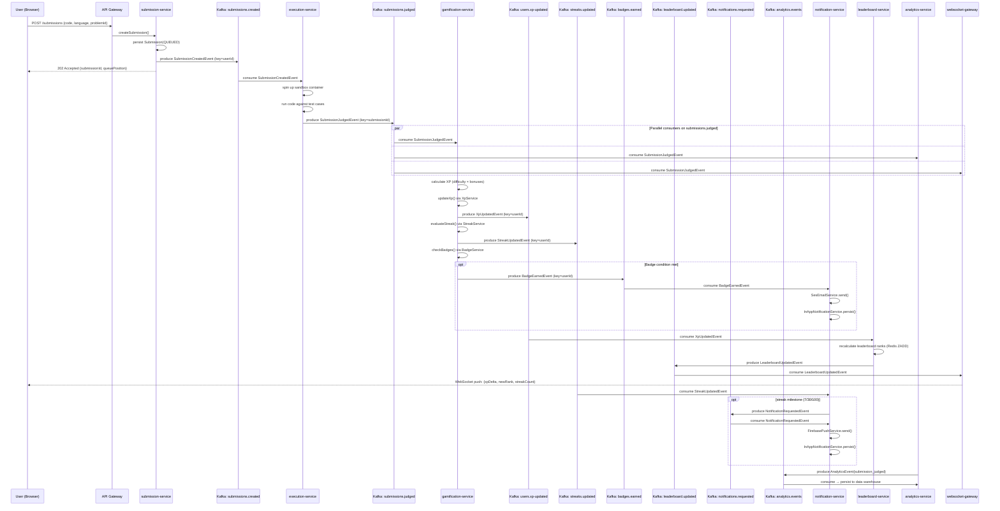
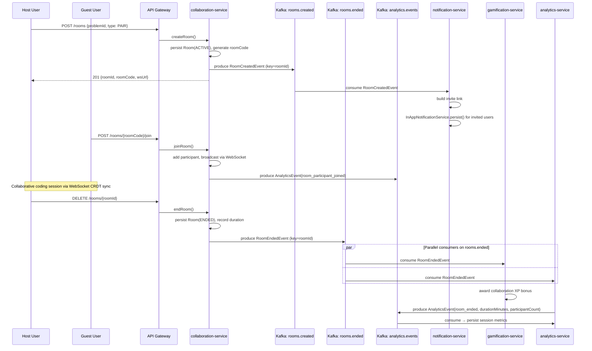
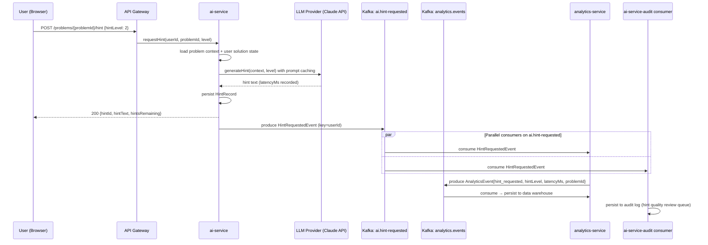

# AlgoVerse — Kafka Event-Driven Architecture

> Version: 1.0  
> Last Updated: 2026-05-23  
> Owner: Platform Engineering

---

## Table of Contents

1. [Overview](#overview)
2. [Topic Catalog](#topic-catalog)
3. [Event Flow Diagrams](#event-flow-diagrams)
4. [Consumer Group Strategy](#consumer-group-strategy)
5. [Dead Letter Queue Strategy](#dead-letter-queue-strategy)
6. [Schema Evolution Policy](#schema-evolution-policy)
7. [Operational Runbook](#operational-runbook)

---

## Overview

AlgoVerse uses Apache Kafka (via Strimzi on Kubernetes) as the backbone for all asynchronous inter-service communication. Every significant domain action produces an event; downstream services react without coupling. This document is the single source of truth for every topic, consumer group, retry policy, and schema contract.

**Kafka Cluster:** 3-broker Strimzi cluster, SCRAM-SHA-512 auth, TLS in-transit  
**Schema Registry:** Confluent Schema Registry (Avro schemas, backward-compatible evolution)  
**Serialization:** JSON (application layer) wrapped in Avro envelope for schema enforcement  
**Monitoring:** Kafka Exporter → Prometheus → Grafana dashboards (lag, throughput, error rate)

---

## Topic Catalog

### Naming Convention

```
algoverse.<domain>.<event-noun>
```

All topics use `lz4` compression. Replication factor is 3 across all brokers (min.insync.replicas = 2).

---

### `algoverse.submissions.created`

| Property              | Value                                    |
|-----------------------|------------------------------------------|
| Partitions            | 24                                       |
| Replication Factor    | 3                                        |
| Partition Key         | `userId`                                 |
| Retention             | 7 days (604800000 ms)                    |
| Max Message Bytes     | 1 MB                                     |
| Compression           | lz4                                      |
| Consumer Groups       | `execution-service`, `analytics-service` |
| Schema Version        | v1                                       |

**Purpose:** Fired immediately when a user submits code and the submission record is persisted. The execution-service picks this up to enqueue the sandbox run. Analytics-service logs the submission attempt event. Partitioned by `userId` to preserve per-user ordering (all submissions from the same user arrive in sequence to the same consumer thread, which prevents race conditions on streak counters).

---

### `algoverse.submissions.judged`

| Property              | Value                                                                                             |
|-----------------------|---------------------------------------------------------------------------------------------------|
| Partitions            | 24                                                                                                |
| Replication Factor    | 3                                                                                                 |
| Partition Key         | `submissionId`                                                                                    |
| Retention             | 30 days (2592000000 ms)                                                                           |
| Max Message Bytes     | 2 MB                                                                                              |
| Compression           | lz4                                                                                               |
| Consumer Groups       | `gamification-service`, `analytics-service`, `notification-service`, `leaderboard-service`       |
| Schema Version        | v1                                                                                                |

**Purpose:** Fired by execution-service once the judge sandbox returns a verdict. Contains full result data (status, runtime, memory, test case breakdown). Downstream services react: gamification awards XP/streaks/badges, analytics records the result, notification-service may send a congratulatory message on first accepted, leaderboard-service recalculates rankings. Retained 30 days for audit and replay.

---

### `algoverse.users.registered`

| Property              | Value                                               |
|-----------------------|-----------------------------------------------------|
| Partitions            | 6                                                   |
| Replication Factor    | 3                                                   |
| Partition Key         | `userId`                                            |
| Retention             | 30 days (2592000000 ms)                             |
| Max Message Bytes     | 512 KB                                              |
| Compression           | lz4                                                 |
| Consumer Groups       | `gamification-service`, `notification-service`, `analytics-service` |
| Schema Version        | v1                                                  |

**Purpose:** Fired by auth-service on successful new user registration (OAuth callback or email/password signup). Triggers: gamification-service bootstraps XP and streak records; notification-service sends welcome email; analytics-service records acquisition event with OAuth provider info.

---

### `algoverse.users.xp-updated`

| Property              | Value                                                     |
|-----------------------|-----------------------------------------------------------|
| Partitions            | 12                                                        |
| Replication Factor    | 3                                                         |
| Partition Key         | `userId`                                                  |
| Retention             | 7 days (604800000 ms)                                     |
| Max Message Bytes     | 512 KB                                                    |
| Compression           | lz4                                                       |
| Consumer Groups       | `leaderboard-service`, `analytics-service`, `websocket-gateway` |
| Schema Version        | v1                                                        |

**Purpose:** Fired by gamification-service after crediting XP for any action (submission accepted, daily login, badge earned). Leaderboard-service updates the sorted set in Redis; websocket-gateway pushes the delta to the user's live session; analytics-service records XP progression for funnel analysis.

---

### `algoverse.streaks.updated`

| Property              | Value                                               |
|-----------------------|-----------------------------------------------------|
| Partitions            | 12                                                  |
| Replication Factor    | 3                                                   |
| Partition Key         | `userId`                                            |
| Retention             | 7 days (604800000 ms)                               |
| Max Message Bytes     | 512 KB                                              |
| Compression           | lz4                                                 |
| Consumer Groups       | `notification-service`, `analytics-service`, `badge-service` |
| Schema Version        | v1                                                  |

**Purpose:** Fired by gamification-service after evaluating daily streak status. Notification-service checks for milestone streaks (7, 30, 100 days) and dispatches push + in-app notifications. Badge-service checks streak-based badge conditions. Analytics tracks retention cohorts.

---

### `algoverse.badges.earned`

| Property              | Value                                               |
|-----------------------|-----------------------------------------------------|
| Partitions            | 6                                                   |
| Replication Factor    | 3                                                   |
| Partition Key         | `userId`                                            |
| Retention             | 30 days (2592000000 ms)                             |
| Max Message Bytes     | 512 KB                                              |
| Compression           | lz4                                                 |
| Consumer Groups       | `notification-service`, `analytics-service`, `websocket-gateway` |
| Schema Version        | v1                                                  |

**Purpose:** Fired by gamification-service when a badge condition is satisfied. Notification-service sends email + in-app badge unlock message. Websocket-gateway pushes a live celebration animation. Analytics records badge acquisition for achievement funnel tracking.

---

### `algoverse.rooms.created`

| Property              | Value                                               |
|-----------------------|-----------------------------------------------------|
| Partitions            | 6                                                   |
| Replication Factor    | 3                                                   |
| Partition Key         | `roomId`                                            |
| Retention             | 1 day (86400000 ms)                                 |
| Max Message Bytes     | 512 KB                                              |
| Compression           | lz4                                                 |
| Consumer Groups       | `notification-service`, `analytics-service`         |
| Schema Version        | v1                                                  |

**Purpose:** Fired by collaboration-service when a new collaborative coding room is instantiated. Short retention (1 day) as room lifecycle is ephemeral. Notification-service sends join-link to invited participants; analytics tracks room creation rate.

---

### `algoverse.rooms.ended`

| Property              | Value                                               |
|-----------------------|-----------------------------------------------------|
| Partitions            | 6                                                   |
| Replication Factor    | 3                                                   |
| Partition Key         | `roomId`                                            |
| Retention             | 7 days (604800000 ms)                               |
| Max Message Bytes     | 512 KB                                              |
| Compression           | lz4                                                 |
| Consumer Groups       | `analytics-service`, `gamification-service`         |
| Schema Version        | v1                                                  |

**Purpose:** Fired when a room session terminates (host ends or inactivity timeout). Gamification-service can award collaboration XP bonus; analytics records session duration and participant count for product metrics.

---

### `algoverse.ai.hint-requested`

| Property              | Value                                               |
|-----------------------|-----------------------------------------------------|
| Partitions            | 12                                                  |
| Replication Factor    | 3                                                   |
| Partition Key         | `userId`                                            |
| Retention             | 7 days (604800000 ms)                               |
| Max Message Bytes     | 1 MB                                                |
| Compression           | lz4                                                 |
| Consumer Groups       | `analytics-service`, `ai-service-audit`             |
| Schema Version        | v1                                                  |

**Purpose:** Fired by ai-service after a hint is generated and returned to the user. Used for AI usage analytics (hint frequency, hint level distribution, latency tracking) and AI audit logging for model quality review.

---

### `algoverse.notifications.requested`

| Property              | Value                                               |
|-----------------------|-----------------------------------------------------|
| Partitions            | 12                                                  |
| Replication Factor    | 3                                                   |
| Partition Key         | `userId`                                            |
| Retention             | 1 day (86400000 ms)                                 |
| Max Message Bytes     | 512 KB                                              |
| Compression           | lz4                                                 |
| Consumer Groups       | `notification-service`                              |
| Schema Version        | v1                                                  |

**Purpose:** Generic notification dispatch topic. Any service that needs to send a notification without directly depending on notification-service produces here. Notification-service routes to the correct channel (EMAIL, PUSH, IN_APP) based on user preferences. Short retention as notifications are time-sensitive.

---

### `algoverse.analytics.events`

| Property              | Value                                               |
|-----------------------|-----------------------------------------------------|
| Partitions            | 48                                                  |
| Replication Factor    | 3                                                   |
| Partition Key         | `sessionId`                                         |
| Retention             | 90 days (7776000000 ms)                             |
| Max Message Bytes     | 2 MB                                                |
| Compression           | lz4                                                 |
| Consumer Groups       | `analytics-service`, `data-warehouse-sink`          |
| Schema Version        | v1                                                  |

**Purpose:** High-volume firehose for all page views, UI interactions, feature usage events from both frontend (web/mobile) and backend services. Partitioned by `sessionId` to keep session event ordering. 48 partitions support peak load of ~50K events/sec. `data-warehouse-sink` uses Kafka Connect with S3 sink to materialize into the data lake for BI and ML feature pipelines.

---

### `algoverse.leaderboard.updated`

| Property              | Value                                               |
|-----------------------|-----------------------------------------------------|
| Partitions            | 3                                                   |
| Replication Factor    | 3                                                   |
| Partition Key         | `period` (daily/weekly/all-time)                    |
| Retention             | 1 day (86400000 ms)                                 |
| Max Message Bytes     | 5 MB                                                |
| Compression           | lz4                                                 |
| Consumer Groups       | `websocket-gateway`, `analytics-service`            |
| Schema Version        | v1                                                  |

**Purpose:** Fired by leaderboard-service after recalculating rankings (triggered by XP update). Contains top-N snapshot. Websocket-gateway pushes live leaderboard updates to connected clients. Low partition count (3) because leaderboard updates are low frequency (~100/min) compared to other topics.

---

### `algoverse.problems.solved-first-time`

| Property              | Value                                               |
|-----------------------|-----------------------------------------------------|
| Partitions            | 12                                                  |
| Replication Factor    | 3                                                   |
| Partition Key         | `userId`                                            |
| Retention             | 30 days (2592000000 ms)                             |
| Max Message Bytes     | 512 KB                                              |
| Compression           | lz4                                                 |
| Consumer Groups       | `gamification-service`, `analytics-service`, `notification-service` |
| Schema Version        | v1                                                  |

**Purpose:** Fired when a user solves a problem for the first time (acceptance with no prior AC on that problem). This distinct event (separate from `submissions.judged`) allows downstream services to apply first-solve bonuses cleanly without repeated idempotency checks. Gamification applies 2× XP multiplier; notification-service sends congratulatory message; analytics tracks problem completion rates.

---

## Event Flow Diagrams

### Flow 1 — Code Submission Pipeline

Full chain from user submitting code to leaderboard update and analytics logging.



---

### Flow 2 — Collaborative Room Lifecycle



---

### Flow 3 — AI Hint Request



---

## Consumer Group Strategy

Each consumer group has a dedicated name that identifies the consuming service. Offset commits use **manual acknowledgment** (after successful processing) to prevent message loss. Auto-commit is disabled across all consumers.

| Topic | Consumer Group | Service | Offset Strategy | Notes |
|-------|---------------|---------|-----------------|-------|
| `algoverse.submissions.created` | `execution-service` | execution-service | Manual, after sandbox job enqueued | Concurrency = partition count (24) |
| `algoverse.submissions.created` | `analytics-service` | analytics-service | Manual, after DB write | |
| `algoverse.submissions.judged` | `gamification-service` | gamification-service | Manual, after XP+streak+badge written | Idempotency via Redis |
| `algoverse.submissions.judged` | `analytics-service` | analytics-service | Manual, after event persisted | |
| `algoverse.submissions.judged` | `notification-service` | notification-service | Manual, after notification dispatched | |
| `algoverse.submissions.judged` | `leaderboard-service` | leaderboard-service | Manual, after Redis ZADD | |
| `algoverse.users.registered` | `gamification-service` | gamification-service | Manual, after XP/streak bootstrap | |
| `algoverse.users.registered` | `notification-service` | notification-service | Manual, after welcome email sent | |
| `algoverse.users.registered` | `analytics-service` | analytics-service | Manual, after event persisted | |
| `algoverse.users.xp-updated` | `leaderboard-service` | leaderboard-service | Manual, after rank recalculated | |
| `algoverse.users.xp-updated` | `analytics-service` | analytics-service | Manual, after persisted | |
| `algoverse.users.xp-updated` | `websocket-gateway` | websocket-gateway | Manual, after WS push attempted | |
| `algoverse.streaks.updated` | `notification-service` | notification-service | Manual, after milestone check | |
| `algoverse.streaks.updated` | `analytics-service` | analytics-service | Manual | |
| `algoverse.streaks.updated` | `badge-service` | gamification-service | Manual, after badge check | Subset of gamification-service |
| `algoverse.badges.earned` | `notification-service` | notification-service | Manual, after email+in-app | |
| `algoverse.badges.earned` | `analytics-service` | analytics-service | Manual | |
| `algoverse.badges.earned` | `websocket-gateway` | websocket-gateway | Manual, after WS push | |
| `algoverse.rooms.created` | `notification-service` | notification-service | Manual, after invite sent | |
| `algoverse.rooms.created` | `analytics-service` | analytics-service | Manual | |
| `algoverse.rooms.ended` | `analytics-service` | analytics-service | Manual | |
| `algoverse.rooms.ended` | `gamification-service` | gamification-service | Manual, after collab XP awarded | |
| `algoverse.ai.hint-requested` | `analytics-service` | analytics-service | Manual | |
| `algoverse.ai.hint-requested` | `ai-service-audit` | ai-service | Manual, after audit log write | Separate consumer group in ai-service |
| `algoverse.notifications.requested` | `notification-service` | notification-service | Manual, after channel dispatch | |
| `algoverse.analytics.events` | `analytics-service` | analytics-service | Manual, after persisted | |
| `algoverse.analytics.events` | `data-warehouse-sink` | Kafka Connect S3 Sink | Auto (Kafka Connect manages) | Batch size: 10K records |
| `algoverse.leaderboard.updated` | `websocket-gateway` | websocket-gateway | Manual, after WS push | |
| `algoverse.leaderboard.updated` | `analytics-service` | analytics-service | Manual | |
| `algoverse.problems.solved-first-time` | `gamification-service` | gamification-service | Manual, after 2x XP applied | Idempotency via Redis |
| `algoverse.problems.solved-first-time` | `analytics-service` | analytics-service | Manual | |
| `algoverse.problems.solved-first-time` | `notification-service` | notification-service | Manual, after congrats sent | |

### Consumer Configuration Defaults

```properties
# Applied to all consumers
enable.auto.commit=false
auto.offset.reset=earliest
max.poll.records=500
max.poll.interval.ms=300000
session.timeout.ms=45000
heartbeat.interval.ms=15000
fetch.min.bytes=1024
fetch.max.wait.ms=500
isolation.level=read_committed
```

---

## Dead Letter Queue Strategy

### DLQ Topic Naming Convention

Every consumer topic has a corresponding DLQ:

```
algoverse.<domain>.<event>.dlq
```

Examples:
- `algoverse.submissions.judged.dlq`
- `algoverse.badges.earned.dlq`
- `algoverse.notifications.requested.dlq`

### DLQ Topic Configuration

| Property           | Value                        |
|--------------------|------------------------------|
| Partitions         | Same as source topic         |
| Replication Factor | 3                            |
| Retention          | 14 days (1209600000 ms)      |
| Compression        | lz4                          |
| Consumer Groups    | `<service>-dlq-processor`    |

### Retry Policy

All consumers implement **exponential backoff with jitter** before routing to DLQ:

```
Attempt 1: immediate
Attempt 2: 1s delay
Attempt 3: 2s delay (× 2 multiplier)
After 3 failures: publish to DLQ with failure metadata headers
```

**Spring Kafka Configuration:**

```java
@Bean
public DefaultErrorHandler kafkaErrorHandler(KafkaTemplate<String, Object> template) {
    DeadLetterPublishingRecoverer recoverer = new DeadLetterPublishingRecoverer(template,
        (record, ex) -> new TopicPartition(record.topic() + ".dlq", record.partition()));

    ExponentialBackOffWithMaxRetries backOff = new ExponentialBackOffWithMaxRetries(3);
    backOff.setInitialInterval(1_000L);   // 1s
    backOff.setMultiplier(2.0);           // 2s, 4s
    backOff.setMaxInterval(10_000L);      // cap at 10s

    return new DefaultErrorHandler(recoverer, backOff);
}
```

### DLQ Headers

Every message routed to DLQ carries these Kafka headers:

| Header Key                     | Value                                         |
|-------------------------------|-----------------------------------------------|
| `x-algoverse-original-topic`  | Source topic name                             |
| `x-algoverse-original-partition` | Source partition number                    |
| `x-algoverse-original-offset` | Source message offset                         |
| `x-algoverse-failure-reason`  | Exception class name                          |
| `x-algoverse-failure-message` | Exception message (truncated to 500 chars)    |
| `x-algoverse-retry-count`     | Number of attempts made (always 3)            |
| `x-algoverse-failed-at`       | ISO 8601 timestamp of final failure           |
| `x-algoverse-correlation-id`  | Correlation ID from original event            |

### Poison Pill Handling

A **poison pill** is a malformed message that cannot be deserialized at all (e.g., corrupt bytes, schema mismatch). These are handled separately from retry-eligible failures:

1. Deserialization errors are caught by `ErrorHandlingDeserializer` wrapping the actual deserializer.
2. The raw bytes are forwarded to `algoverse.poison-pills` topic (single partition, 30-day retention).
3. An alert is fired to PagerDuty via the `poison-pill-alerter` consumer.
4. The offset is committed to prevent blocking the partition.

```properties
# Deserializer wrapper config
spring.kafka.consumer.value-deserializer=org.springframework.kafka.support.serializer.ErrorHandlingDeserializer
spring.kafka.consumer.properties.spring.deserializer.value.delegate.class=org.springframework.kafka.support.serializer.JsonDeserializer
```

### DLQ Reprocessing

The `dlq-admin-service` provides a REST API for ops to:
- **Inspect:** `GET /dlq/{topic}/messages?limit=50`
- **Reprocess:** `POST /dlq/{topic}/reprocess` — republishes messages to source topic after manual fix
- **Discard:** `POST /dlq/{topic}/discard/{offset}` — commits offset to drop permanently

Reprocessing is rate-limited to 100 messages/minute to avoid thundering-herd on recovering services.

---

## Schema Evolution Policy

### Avro Schema Registry

All event schemas are registered in Confluent Schema Registry under the subject naming convention:

```
<topic-name>-value
```

Example: `algoverse.submissions.judged-value`

### Compatibility Mode

All subjects are configured with **BACKWARD** compatibility as the default. This means:
- New consumers reading old data: always works
- Old consumers reading new data: works if new fields have defaults

### Compatibility Rules

| Change Type | Allowed? | Notes |
|-------------|----------|-------|
| Add optional field with default | Yes | Backward + Forward compatible |
| Add required field without default | No | Breaking — must use v2 topic or two-phase deploy |
| Remove optional field | Yes (Backward only) | Old consumers ignore; new consumers use default |
| Remove required field | No | Breaking change |
| Rename field | No | Use alias + field deprecation pattern |
| Change field type (widening: int → long) | Yes | With explicit type promotion |
| Change field type (narrowing: long → int) | No | Breaking |
| Add enum value | Yes (with FORWARD compat) | Requires FULL compat mode for enums |
| Remove enum value | No | Breaking |

### Schema Versioning Workflow

```
1. Developer creates new .avsc file: src/main/avro/SubmissionJudgedV2.avsc
2. Run: mvn schema-registry:register  (validates compatibility before CI)
3. CI pipeline runs schema compatibility check against registry
4. Deploy producer service first (produces new schema, old consumers still work)
5. Deploy consumer services
6. After all consumers updated, optionally clean up old schema version
```

### Breaking Change Protocol

When a breaking change is unavoidable:

1. Create a new topic: `algoverse.submissions.judged.v2`
2. Run dual-write in producer: publish to both `v1` and `v2` topics for a 2-week migration window
3. Migrate consumers one by one to `v2` topic
4. Deprecate `v1` topic (reduce retention to 1 day, alert on consumer lag > 0)
5. Remove `v1` topic after all consumers migrated

### Field Deprecation Pattern

Fields are deprecated in schema before removal:

```json
{
  "name": "legacyField",
  "type": ["null", "string"],
  "default": null,
  "doc": "DEPRECATED: use newField instead. Will be removed in schema v3."
}
```

---

## Operational Runbook

### Consumer Lag Alerts

| Alert | Condition | Severity | Action |
|-------|-----------|----------|--------|
| High consumer lag | lag > 10,000 on any partition | WARNING | Scale consumer replicas |
| Critical consumer lag | lag > 100,000 | CRITICAL | Page on-call, investigate consumer health |
| Consumer group stopped | no offset commits for 5 min | CRITICAL | Check pod logs, restart if OOMKilled |
| DLQ accumulating | DLQ topic has messages > 0 | WARNING | Inspect DLQ messages within 1 hour |

### Topic Monitoring Queries (PromQL)

```promql
# Consumer lag by group
kafka_consumergroup_lag_sum{consumergroup="gamification-service"}

# Message throughput (messages/sec)
rate(kafka_topic_partition_current_offset{topic="algoverse.submissions.judged"}[5m])

# DLQ message count
kafka_topic_partition_current_offset{topic=~".*\\.dlq"}
```

### Partition Rebalancing

Cruise Control is deployed alongside the Kafka cluster (see `strimzi-kafka-cluster.yaml`). It runs auto-rebalancing nightly at 02:00 UTC. Manual trigger:

```bash
kubectl exec -it kafka-cruise-control-0 -- curl -X POST \
  "http://localhost:9090/kafkacruisecontrol/rebalance?dryrun=false"
```
